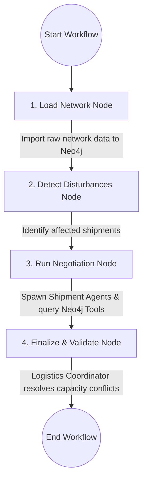
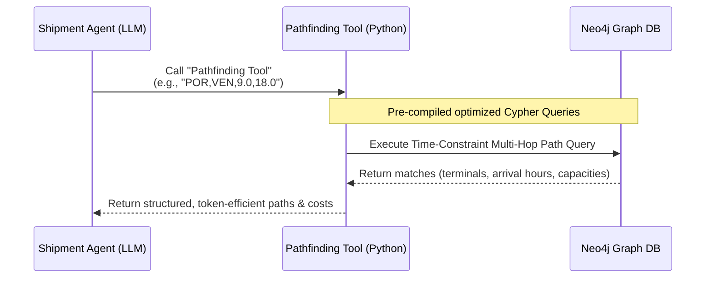

# Documentation Guide: Synchromodal Freight Transportation AI Agentic Replanning Workflow

## Research Paper Reference
**Title:** *Hinterland freight transportation replanning model under the framework of synchromodality*  
**Journal:** Transportation Research Part E: Logistics and Transportation Review, Volume 131 (2019), Pages 308–328  
**Authors:** Wenhua Qu, Jie Yan, Rudy R. Negenborn, Gabriel Lodewijks  

---

## Table of Contents
1. [Project Overview & Core Philosophy](#1-project-overview--core-philosophy)
2. [Advanced AI Agentic & Multi-Agent Architecture (LangGraph + CrewAI)](#2-advanced-ai-agentic--multi-agent-architecture-langgraph--crewai)
3. [High-Performance Neo4j Tool-Calling Design](#3-high-performance-neo4j-tool-calling-design)
4. [Installation & Environment Setup](#4-installation--environment-setup)
5. [How to Run (Execution Order & Web Dashboard)](#5-how-to-run-execution-order--web-dashboard)
6. [Technical Optimizations & Design Decisions](#6-technical-optimizations--design-decisions)

---

## 1. Project Overview & Core Philosophy

This repository contains a state-of-the-art **AI Agentic Replanning Workflow** designed for hinterland freight synchromodal transportation. It implements an advanced multi-agent stakeholder negotiation model, utilizing **LangGraph** and **CrewAI** to dynamically re-route cargo container shipments when real-time network disturbances occur. 

All operations, including pathfinding, capacity verification, and pricing calculations, are executed autonomously by LLM agents calling custom high-performance tools connected to a **Neo4j Graph Database**.

### What is Synchromodality?
In traditional intermodal logistics, container shipments are locked into pre-planned paths (e.g., Barge A departing at Hour 10). When a disturbance occurs—such as a cargo release delay or barge port closure—re-routing is slow and expensive. 

**Synchromodality** introduces dynamic, real-time flexibility: shipments can instantly switch modes (Barge ↔ Rail ↔ Truck) mid-journey in response to network fluctuations to minimize costs and penalty delays.

---

## 2. Advanced AI Agentic & Multi-Agent Architecture (LangGraph + CrewAI)

When running the agentic workflow, instead of throwing all data into a single massive LLM prompt, the system compiles a **LangGraph state machine** that coordinates specialized **CrewAI micro-crews** to negotiate routes individually, mimicking real-world supply chain stakeholders.



### 2.1 LangGraph State Nodes
1.  **`load_network`:** Connects to the **Neo4j Graph Database** and performs high-speed batched imports of terminals, services, scheduled arcs, and cargo shipments using optimized Cypher queries.
2.  **`detect_disturbances`:** A pure-Python node that evaluates network events (e.g., late release times) and flags which shipments require immediate replanning.
3.  **`run_negotiation`:** Spawns a dedicated **Shipment Agent** for each affected cargo shipment to autonomously search for, evaluate, and reserve the best available routes.
4.  **`finalize`:** Launches a senior **Logistics Coordinator Agent** to review all proposed plans, detect and resolve capacity bottlenecks (e.g., multiple agents booking the same limited rail capacity), and generate the consolidated system replanning report.

### 2.2 The Micro-Agent Rosters (CrewAI)
*   **The Shipment Agent:** acts as the cargo owner. Its goal is to find the lowest-cost route that respects release times and delivery deadlines. It utilizes Neo4j-backed tools to perform pathfinding, check capacities, and calculate costs.
*   **The Service Operator Agent:** manages scheduled barge, rail, and truck fleets, reporting live capacities and alerting the network when specific corridors are approaching bottleneck limits.
*   **The Logistics Coordinator Agent:** represents port operations (e.g., Port of Rotterdam). It arbitrates disputes between Shipment Agents, resolves slot allocation conflicts on congested services, and validates the final system-wide schedule.

---

## 3. High-Performance Neo4j Tool-Calling Design

To keep the agentic workflow highly token-efficient, fast, and scalable, we developed a series of **custom Python tools** linked directly to our Neo4j Database in `tools.py`. Instead of forcing LLM agents to fetch raw data and calculate paths manually, these tools execute optimized database operations.



### 3.1 Custom Tool Catalog
1.  **Pathfinding Tool (`PathfindingTool`):** 
    *   **Input format:** `"ORIGIN,DESTINATION,EARLIEST_START,LATEST_ARRIVAL"` (e.g. `"POR,VEN,9.0,18.0"`).
    *   **Under the Hood:** Executes a deep multi-hop Cypher query that traverses terminal nodes and arc nodes, ensuring timing constraints are met ($y_{\text{dep}} \ge \text{earliest}$ and $y_{\text{arr}} \le \text{latest}$) and returns sorted feasible routes.
2.  **Service Capacity Tool (`ServiceCapacityTool`):**
    *   **Input format:** `arc_id` (e.g. `"v0001_POR_DUIS"`).
    *   **Under the Hood:** Queries the current loaded volume of all shipments booked on that arc and returns the remaining capacity in TEUs.
3.  **Cost Calculator Tool (`CostCalculatorTool`):**
    *   **Input format:** `"SHIPMENT_ID:ARC1,ARC2..."`.
    *   **Under the Hood:** Performs a single-roundtrip batched query to calculate the combined variable transport cost based on cargo volume and arc prices.
4.  **Neo4j Search Tool (`Neo4jSearchTool`):**
    *   Allows agents to perform custom ad-hoc Cypher queries for advanced status checks, automatically capped to prevent bloating the LLM context.

---

## 4. Installation & Environment Setup

### 4.1 Prerequisites
*   **Operating System:** Windows, macOS, or Linux.
*   **Python:** Version `3.10` or higher is recommended.
*   **Docker Desktop:** Installed and running (for Neo4j Containerization).

### 4.2 Step-by-Step Installation

#### Step 1: Clone the Repository & Verify CWD
First, clone the repository to your local machine:
```powershell
git clone https://github.com/your-github-username/agenticflow_synchromodal_transport
cd agenticflow_synchromodal_transport
```

#### Step 2: Set up the Python Virtual Environment
Initialize a local virtual environment named `venv` to keep dependencies clean:
```powershell
python -m venv venv
```
Activate the environment:
*   **On Windows (PowerShell):**
    ```powershell
    .\venv\Scripts\Activate.ps1
    ```
*   **On macOS/Linux:**
    ```bash
    source venv/bin/activate
    ```

#### Step 3: Install Required Dependencies
Install the custom synchromodal package stack:
```powershell
pip install -r requirements_agentic.txt
```

---

## 5. How to Run (Execution Order & Web Dashboard)

To ensure a seamless, error-free run, execute the components in the following precise order:

### 🚀 Step 1: Start the Docker Container & Neo4j
The agentic workflow relies on a running Neo4j container with the APOC plugin enabled. 

1.  Open **Docker Desktop** on your computer.
2.  Launch the pre-configured database container named `neo4j-synchro`:
    ```powershell
    docker start neo4j-synchro
    ```

### 🔑 Step 2: Configure Environment Variables
Ensure your configurations are correct:
```env
GOOGLE_API_KEY="YOUR_VALID_GEMINI_API_KEY"
NEO4J_URI=bolt://localhost:7687
NEO4J_USER=neo4j
NEO4J_PASSWORD=your_neo4j_password
CREWAI_LLM_MODEL=gemini/gemini-2.5-flash
```

### 💻 Step 3: Run the Agentic Workflow
You can run the Python agentic workflow directly from the command line:

*   **To run the full Agentic workflow (with LLM and Neo4j):**
    ```powershell
    python agentic_replanning_main.py
    ```
*   **To run the Mock Demo (without requiring a Gemini API key or Docker/Neo4j):**
    ```powershell
    python agentic_replanning_main.py --mock
    ```

---

### 📊 Step 4: The Visual Web Dashboard
To launch the FastAPI web server and open the interactive web control panel:

1.  Start the FastAPI server:
    ```powershell
    python server.py
    ```
2.  Open your web browser and navigate to:
    ```
    http://localhost:8000
    ```
This serves a gorgeous control center where you can:
1.  **View LangGraph States:** See the active node highlighted in real-time as the workflow transitions from ingestion to finalization.
2.  **Explore the 3D Graph (Cytoscape):** Interact with a live, responsive visualization of the Neo4j database—zoom and move Terminals, scheduled Arcs, operating Services, and assigned Shipment nodes.
3.  **Run Replanning Scenarios:** Trigger route optimizations dynamically and inspect the generated consolidated report!

---

## 6. Technical Optimizations & Design Decisions

### 6.1 Optimized Database Round-trips
Every custom tool in `tools.py` uses pre-joined, batched Cypher queries. For example, instead of querying an arc's details and subsequently querying shipment sizes in separate loops, the **Capacity** and **Cost Calculator** tools bundle these lookups into single, atomic Cypher queries, keeping database load extremely lightweight.

### 6.2 Rate-Limit Safeguard (Adaptive Back-Off)
Free-tier Gemini keys are heavily rate-limited (typically 20 requests/day or 15 RPM). The `workflow.py` engine features an **adaptive back-off loop with random jitter**. When a `429 Rate Limit` is returned, the system pauses, backs off exponentially, and retries up to three times before falling back to a structured Python-generated report. This keeps the application robust even under heavy traffic.
