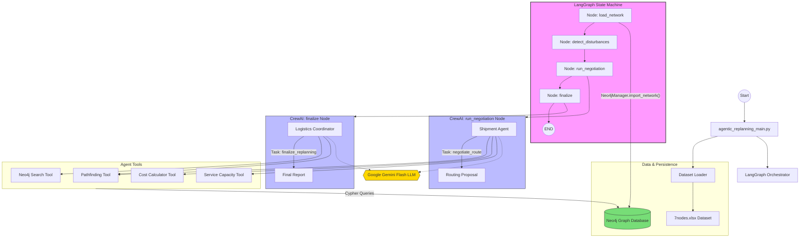

# Agentic Synchromodal Architecture Design

This document describes the architecture of the LangGraph-based agentic approach for synchromodal freight replanning.

## Architecture Diagram



## Technical Workflow Breakdown

### 1. Orchestration Layer (LangGraph)
- **State Management**: Tracks the `network_model`, `neo4j_manager`, `affected_shipments`, and `proposals` across nodes.
- **Node-Based Flow**:
    - `load_network`: Clears and re-imports the current network model into Neo4j.
    - `detect_disturbances`: Identifies which shipments need replanning based on delay data.
    - `run_negotiation`: Triggers the agentic route discovery process.
    - `finalize`: Consolidates multi-agent proposals into a single valid plan.

### 2. Multi-Agent Layer (CrewAI)
- **Shipment Agent**: Represents individual cargo interests. Its goal is to find the most cost-effective path using specific constraints (time windows, service modes).
- **Logistics Coordinator**: Represents the port/network operator. It resolves capacity conflicts and ensures the overall network KPI (modal split and cost) is optimized.
- **Service Operator (Optional/Ready)**: Designed to manage specific modes like Barge or Rail and report real-time capacity.

### 3. Intelligence & Tooling
- **LLM**: Powered by **Google Gemini Flash** for high-speed reasoning and tool selection.
- **Pathfinding Tool**: Queries Neo4j for feasible routes between terminals.
- **Service Capacity Tool**: Checks real-time TEU availability on specific transport arcs.
- **Cost Calculator Tool**: Computes the variable cost of a proposed shipment path.

### 4. Persistence Layer (Neo4j)
- **Graph Modeling**: Represents the transportation network as nodes (Terminals) and edges (Services/Arcs).
- **Relational Integrity**: Tracks which shipments are assigned to which services, allowing for real-time capacity monitoring.

### 5. Division of Labor

To understand how the technologies fit together without overlapping:

- **Neo4j (The Environment/Memory)**: Stores the static and dynamic state of the world (terminals, arcs, available TEU capacities, costs). It answers specific queries but does not "think."
- **LangGraph (The Orchestrator)**: Acts as the rigid assembly line. It strictly enforces the workflow order of operations (`load_network` -> `detect_disturbances` -> `run_negotiation` -> `finalize`).
- **Gemini LLM (The Cognitive Worker)**: Sits *inside* the LangGraph nodes (specifically powering the CrewAI agents). It acts as the "brain," dynamically analyzing the disturbances, deciding what Neo4j queries to run via autonomous tool selection, interpreting the graph data, and handling complex logic and negotiation to make final routing decisions.

## Detailed Agentic Approach

In this project, you are using a **Multi-Agent System** (powered by the CrewAI framework) embedded inside a larger deterministic workflow (LangGraph). 

This "agentic approach" means that instead of writing hard-coded `if/else` statements for every possible scenario (e.g., *if ship is delayed, then route via train, unless train is full, then route via truck*), you define **personas** (Agents), give them **abilities** (Tools), and assign them **goals** (Tasks). The Gemini LLM acts as the reasoning engine for these agents.

Here is a detailed breakdown of how your specific agentic approach works:

### 1. The Personas (The Agents)
You have designed specific roles to mimic a real-world logistics control tower (in `agents.py`):
*   **Shipment Agent:** A dedicated advocate for a single piece of cargo. Its only goal is to ensure *its specific shipment* gets to the destination on time and as cheaply as possible. It is heavily constrained by time windows and prefers rail/barge but will resort to trucks if deadlines are tight.
*   **Logistics Coordinator:** The supervisor. It looks at the big picture of the port/network. Its goal is to make sure the whole system runs smoothly, resolving conflicts between multiple shipment agents and keeping the overall network sustainable (favoring rail/barge over trucks).
*   **Service Operator:** Represents the transport providers (e.g., the Rail or Barge operators). It monitors its own capacity and ensures its specific mode of transport is filled efficiently without overbooking.

### 2. The Abilities (The Tools)
Agents cannot magically know the state of your supply chain. You provide them with specific tools (in `tools.py`) that they can autonomously choose to use when they need information:
*   **Pathfinding Tool:** Allows an agent to ask, "What are the physical routes from Terminal A to Terminal B?"
*   **Cost Calculator Tool:** Allows an agent to ask, "If I take this route, how much will it cost?"
*   **Service Capacity Tool:** Allows an agent to ask, "Does this barge still have room for my 10 containers?"
*   **Neo4j Search Tool:** A general query tool for the Logistics Coordinator to understand the overall state of the network.

### 3. The Workflow (How they collaborate)
The process of how these agents work together is structured by LangGraph (in `workflow.py`):
1.  **Micro-Crews for Negotiation:** When a delay happens, LangGraph doesn't just create one massive team. Instead, it creates a "micro-crew" for *each affected shipment*. The **Shipment Agent** is given the task to negotiate a route. It uses the Gemini LLM to think: *"I need to go from Rotterdam to Duisburg. Let me use the Pathfinding Tool. Okay, I found a route. Now let me use the Cost Tool to check the price. It's cheap, but let me check the Capacity Tool. Oh, it's full. Let me find another route."*
2.  **Finalization:** Once all the individual Shipment Agents have come up with proposals for their cargo, LangGraph passes all of these proposals to a new Crew led by the **Logistics Coordinator**. The Coordinator uses Gemini to review all the proposals together, ensuring no two agents accidentally double-booked a train, and then outputs a final, validated replanning report.

### Why is this approach powerful?
*   **Autonomy:** You don't have to program the exact sequence of database queries. The LLM figures out which tool to use based on what it discovers.
*   **Scalability & Isolation:** By having individual Shipment Agents, the logic for routing cargo 'A' is isolated from cargo 'B' until the Coordinator steps in.
*   **Resilience:** If a database query returns an unexpected result (like a closed terminal), the agent can dynamically adapt and search for an alternative rather than crashing the program.

## Running the Application

To run this agentic pipeline in sequence, ensure your `.env` file contains your credentials (Neo4j and Gemini API Key), then execute the following:

1. **Start the Web Interface / Backend Server (Recommended for visual dashboard):**
   ```bash
   python server.py
   ```
   *(This starts the FastAPI server that interacts with LangGraph and serves the frontend.)*

2. **Run the CLI Workflow Directly (For terminal debugging):**
   ```bash
   python agentic_replanning_main.py
   ```
